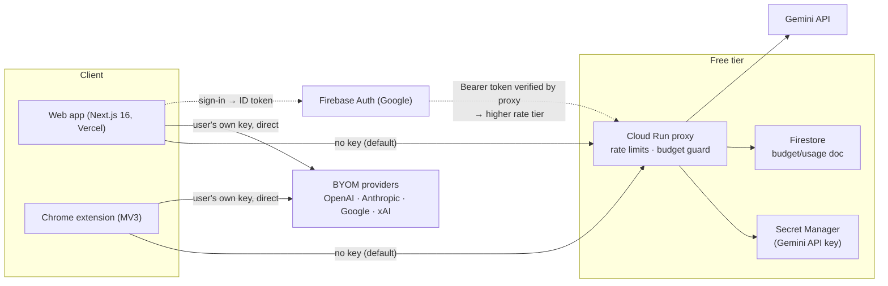

# MDR — Project & Architecture Overview

> **Macro Doc Refinement** — an AI personal-voice engine. Paste anything you wrote; it re-voices the text in real time through your own learned voice, personality modes, and platform presets. "Recording studio, not doctor's office."
>
> Last updated: 2026-07-12. Written for anyone (human or agent) onboarding to the codebase.

## Surfaces

| Surface | Where | Status |
|---|---|---|
| Web app | https://www.macrodocrefinement.com (Vercel, auto-deploys `main`) | Live |
| Chrome extension (MV3) | [`mdr-extension/`](../mdr-extension) — inline widget, side panel, context menus | v0.2.0 submitted to Chrome Web Store |
| Gemini proxy | Cloud Run (`gemini-proxy`, project `macro-doc-refinement-8d9fa`) | Live — fronts the paid Gemini key for the free tier |

## Repository layout (important gotcha)

Two **nested git repositories**:

- **`macrodoc-refinement.git`** (this repo, `mdr-nextjs/`) — the product: Next.js web app + `mdr-extension/`.
- **`macrodocrefinement.git`** (parent directory) — `gemini-proxy-server/` (Cloud Run proxy) plus the deprecated Flutter app (`mdr_web_app/`, replaced by this repo). The design system spec [`DESIGN.md`](../../DESIGN.md) also lives at the parent root.

Changes that span web + proxy need **two PRs**, one per repo (they've historically merged as companion pairs).

## High-level architecture



Telemetry (all env/token-gated, no user text ever captured): **Sentry** (web `NEXT_PUBLIC_SENTRY_DSN`, proxy `SENTRY_DSN`), **PostHog** (product events, `lib/analytics.ts`), **Vercel Analytics** (pageviews).

### The two generation paths

1. **Free tier (default)** — client → proxy → Gemini (`gemini-3.1-flash-lite-preview`). Anonymous: 15 req/min + 500/day per IP. Signed in with Google: 40 req/min + 2,000/day per Firebase uid (proxy verifies the `Authorization: Bearer <id-token>` with firebase-admin; invalid token → 401 `invalid_token`; infra failure fails open to anon).
2. **BYOM** — client → provider API directly with the user's key (localStorage/chrome.storage only; never sent to MDR). Routing rule everywhere: `useDefault = provider === 'default' || !apiKey.trim()`.

### Cost safety (free tier)

The proxy enforces **$100/day and $500 lifetime** budgets (env-tunable) computed from Gemini `usageMetadata` tokens. Counters live in Firestore (`budget/usage`, UTC day-roll) with a per-instance in-memory fallback; exceeding a ceiling returns `503 {error:'budget_exceeded'}` which the web app surfaces verbatim. First trip logs `[BUDGET]` + a Sentry fatal (the owner-notification channel). Read-only status: `GET /api/budget`. The guard **fails open** — a budget bug can never take generation down. GCP Billing alerts are the independent backstop.

## Web app (`mdr-nextjs`)

**Stack**: Next.js 16.2.3 (App Router, static prerender — no API routes), React 19, Tailwind, zustand. ⚠️ `AGENTS.md`: this Next version differs from public docs — consult `node_modules/next/dist/docs/` before framework work.

### Routes

| Route | What |
|---|---|
| `/` | The studio: input ↔ output split pane (drag-resizable), style panel (tone fader, profiles), platform tabs |
| `/voice` | Clone My Voice full editor — samples → AI analysis (editable) → learned profile + live test |
| `/playground` | Generic style editor with live preview (also `?edit=<id>`) |
| `/settings` | BYOM patch bay: provider rack, per-provider keys, custom model ID, signal-chain connection test |
| `/landing` | Marketing page with auto-playing 3-persona re-voicing demo (no API calls) |
| `/legal`, `/privacy` | Disclosures (privacy URL is referenced by the extension's store listing) |

### State — zustand stores (all localStorage-persisted unless noted)

| Store | Key | Notes |
|---|---|---|
| `style-profiles` | `mdr-style-profiles` | Profiles incl. `learned` type. **Persisted state replaces `DEFAULT_PROFILES` wholesale**; new defaults reach existing users via the persist `merge` + `packV1` marker (⚠️ zustand skips `migrate` when stored JSON has no numeric `version` — that's every old install; use the `merge` pattern for future default-shipping) |
| `text-refine` | — (not persisted) | Streaming state machine: 300ms auto-refine debounce, explicit `processNow()`, 30s inactivity watchdog, `data-streaming` attr for ambient glow, sound + analytics hooks |
| `model-config` | `mdr-model-config` | BYOM provider/model + **per-provider key map** (`version: 1` + migrate) |
| `voice-clone` | `mdr-voice-clone` | Samples + linked learned-profile id (transient analysis state not persisted) |
| `multi-post` | — | 4-platform generation, per-platform error/retry, shared AbortController |
| `tone` | — | −1…+1 tone, 5 detents; personality baseline applies only on activation change |
| `auth` | — (not persisted) | Firebase user; `getIdToken()` feeds proxy calls |

Other persisted keys: `mdr-split-ratio`, `mdr-sound-enabled`, `mdr-tip-shown`, `theme`.

### Key modules (`lib/`)

- **`prompt-builder.ts`** — layered prompt: core rules → voice characteristics → personality → tone → custom styles (highest priority, "FOLLOW EXACTLY") → platform constraints → input last. Few-shots attach to their owning layer. ⚠️ A near-copy lives in `mdr-extension/src/shared/` — keep them in sync.
- **`api.ts` / `byom-api.ts`** — proxy SSE / provider-native streaming; shared 30s inactivity watchdog; `budget_exceeded` mapped to its friendly message; Bearer token attached only on proxy calls.
- **`voice-analysis.ts`** — meta-prompt distilling writing samples into ≤1,200-char imperative voice instructions + client-side excerpt selection (proxy caps prompts at 10k chars — never embed raw samples per refine).
- **`theme.tsx`** — custom provider replacing next-themes (its in-body `<script>` breaks React 19 → error #418). The no-flash init runs via `next/script` `beforeInteractive` in the root layout. Themes: `light` / `dark` (default) / `mdr`.
- **`analytics.ts`** — PostHog wrapper: autocapture/recording/surveys off, explicit primitive-only events (`refine_completed`, `voice_cloned`, `signed_in`, …). **Never** capture input/refined text, samples, or keys.
- **`diff.ts`** (A/B word-diff), **`sound.ts`** (Web Audio transport click/tape stop, opt-in), **`firebase.ts`**, **`sentry.ts`** (scrubbed messages only).

### Design system

Single source of truth: [`DESIGN.md`](../../DESIGN.md) (parent repo root). Recording-studio identity: OLED black `#0A0A0C`, amber `#E8A838` glow, teal `#5BB5A2`, Space Grotesk (display) + Geist (body) + JetBrains Mono (labels/data — `text-[11px] uppercase tracking-[0.08em]`). Motion: ease-out, no bounce, streaming is the hero (token bloom + stream-reactive ambient glow), everything honors `prefers-reduced-motion`. The `mdr` theme (triple-click the wordmark) is the Severance/Lumon terminal: CRT on/off, drifting number grid, block cursor.

## Chrome extension (`mdr-extension/`)

MV3: content script (`<all_urls>`) shows an inline **Refine** widget on selection; service worker streams via proxy/BYOM; side panel + popup + options. Key invariants:

- **Text replacement** targets a snapshot captured when the widget appears (never live `activeElement`), writes through the native value setter + `input` event (React-controlled fields), and replaces **only on the explicit `DONE`** — disconnect/error/30s stall keeps the user's text.
- **Profile sync** web ↔ extension: content script relays `mdr-style-profiles` via `SYNC_PROFILES_FROM_WEB`; the worker checks sender origin against an allowlist and structurally validates/caps every profile. The `localhost:3000` origin exists **only in dev builds** (`import.meta.env.DEV` — dead-code-eliminated from store builds).
- Context-menu variants (Professional / Casual / LinkedIn / X) apply distinct presets via `CONTEXT_MENU_PRESETS`.
- `host_permissions` covers the proxy + 4 provider origins, so worker fetches are CORS-exempt.
- Build: `npm run build` → `dist/` (gitignored). Store zip = zip of `dist/` contents with `manifest.json` at the archive root.

## Proxy (`gemini-proxy-server/`, parent repo)

Express on Cloud Run. Middleware chain on `/api/generate`, `/api/stream`, `/api/multi-post`:

```
resolveCaller (Firebase token → tier)  →  rateLimiterMiddleware (per-min + per-day, tier-keyed)
  →  budget.guard ($/day + $ lifetime)  →  validatePromptInput (≤10k chars, model allowlist)
```

- Gemini key from Secret Manager, sent via `x-goog-api-key` header (**never** in URLs); error logging is sanitized (message + status only — raw axios errors carry the key and prompt).
- `trust proxy = 1` (Cloud Run appends the real client IP as the last XFF hop).
- 60s upstream timeout; SSE path has a self-resetting idle timer with a single-close guard.
- ⚠️ **Container is `node:18-slim`** — `firebase-admin` is pinned to v13 (v14 needs Node ≥22 and crash-loops the revision; local dev on newer Node will not catch this — verify against the deployed service).
- Rate limiters are in-memory **per instance** (`--max-instances=3` caps the multiplier); budget counters are the Firestore-durable ones.

Env knobs: `RATE_LIMIT_{ANON,SIGNED}_PER_{MIN,DAY}`, `BUDGET_{DAILY,TOTAL}_USD`, `BUDGET_{INPUT,OUTPUT}_USD_PER_M`, `BUDGET_BACKEND=memory`, `SENTRY_DSN`.

## Operations

| Task | How |
|---|---|
| Deploy web | Merge to `main` → Vercel auto-deploys |
| Deploy proxy | `cd gemini-proxy-server && ./deploy.sh` (gcloud build + Cloud Run deploy) |
| Budget status | `GET https://gemini-proxy-…run.app/api/budget` |
| Errors | Sentry (web + proxy projects); budget trips arrive as Sentry **fatal** |
| Product analytics | PostHog (US cloud) — event catalog in `lib/analytics.ts` call sites |
| Extension release | bump version in `public/manifest.json` + `package.json` → build → zip `dist/` → Web Store dashboard |

**Conventions**: squash-merge PRs; companion web/proxy PRs merge together; never commit `.DS_Store` / `*.import` (Godot scan junk) / build artifacts — already gitignored.

## Security & privacy posture

- BYOM keys: browser-local only (plaintext localStorage — documented tradeoff), sent only to their own provider.
- CSP locked to the exact provider/telemetry/Firebase origins; `COOP: same-origin-allow-popups` (required by `signInWithPopup`); mic Permissions-Policy `self` only.
- Telemetry never contains user-written content; Sentry messages are regex-scrubbed and truncated.
- Legal/privacy pages enumerate the actual providers + telemetry — keep them in lockstep with any new data flow.

## Where things stand (2026-07-12)

Everything from the production audit's 4-week roadmap is **merged and live**: hardening (rate-limit/key-leak/timeout fixes), award polish (tone fader, token bloom, REC states, A/B diff, MDR mode, VU meters, patch bay, sound), Clone My Voice, voice input, budget guard, Google sign-in tiers, landing page, extension store readiness (submitted, in review), PostHog/Sentry, branded favicon. Open threads: Chrome Web Store review result; ideas parked — cross-device profile sync via Firestore, OpenRouter/custom base URL, extension-side voice cloning.
